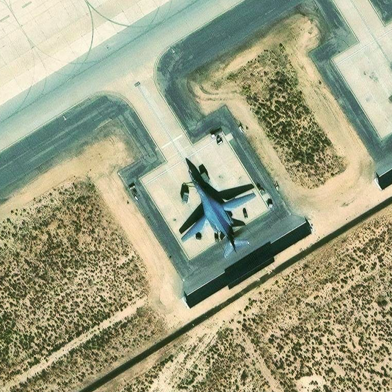
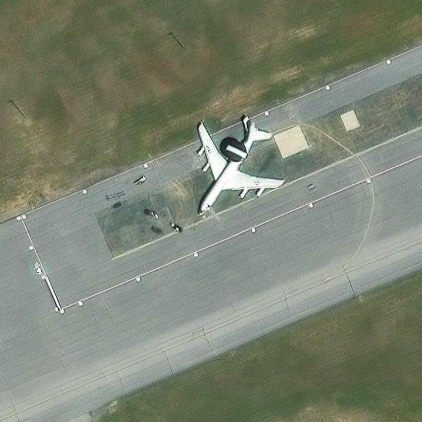
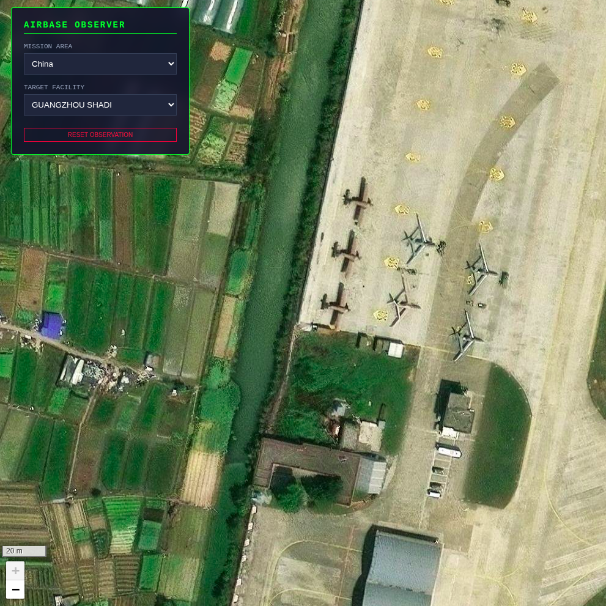
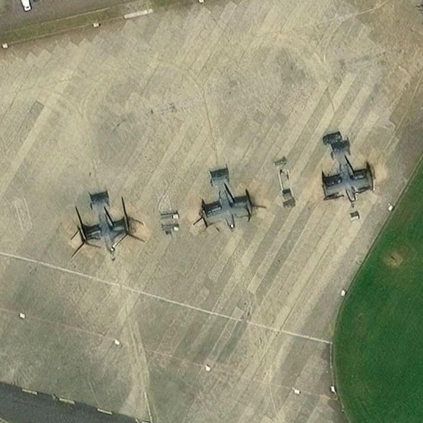
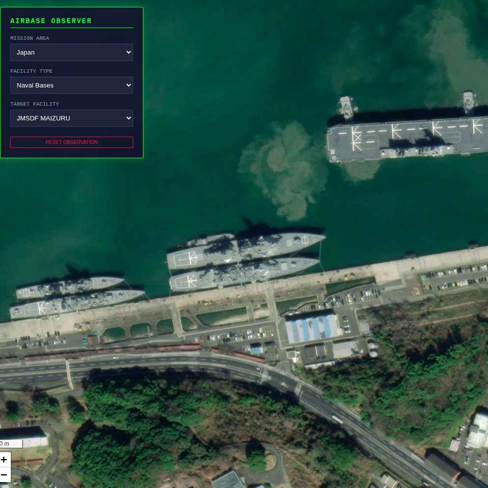
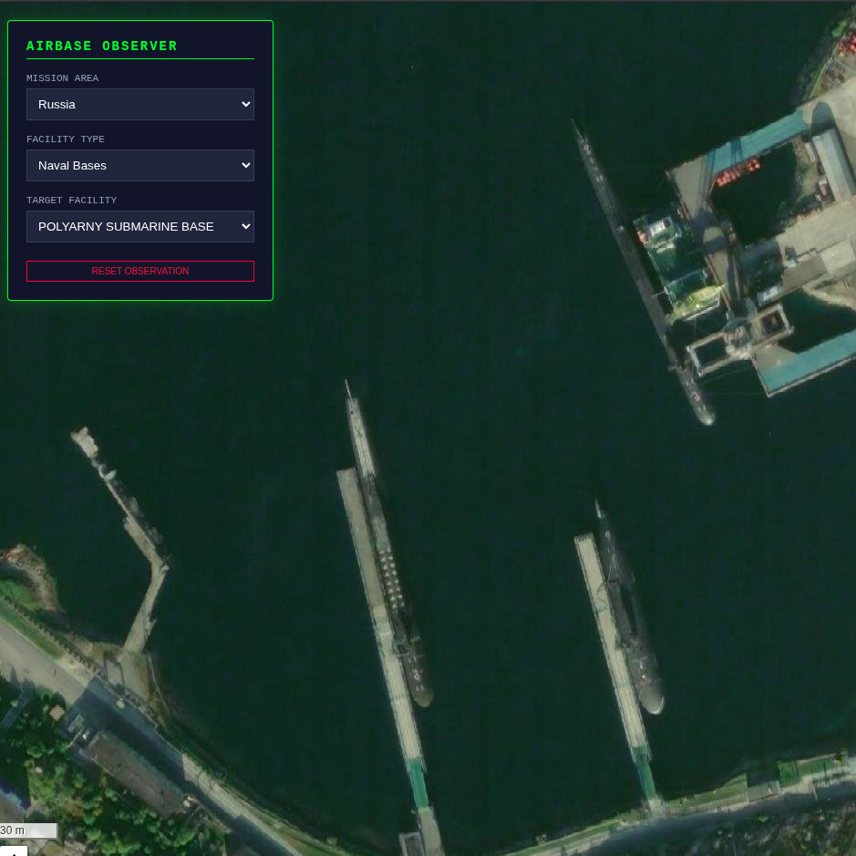
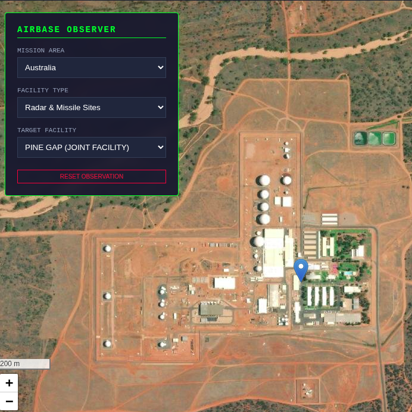
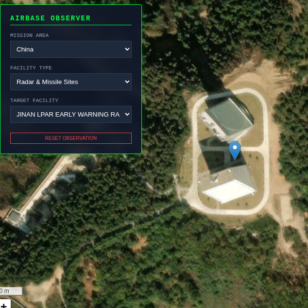

# OSINT Airbase Explorer

Built out of a passion for military aviation, OSINT Airbase Explorer is an interactive satellite-based visualization tool for exploring major airbases around the world.

---

## Overview

OSINT Airbase Explorer is a lightweight geospatial visualization project built using Leaflet and satellite map tiles.  
It allows users to explore publicly known military airbases by country, using an intuitive two-level selection interface.

The project was created as an experimental OSINT-style mapping tool focused on clarity, simplicity, and usability.

---


## 🎥 Video Demo

[](https://youtu.be/svh3ZlUEWDw)

---


## Features

- Satellite map visualization
- Country-based filtering
- Dynamic secondary menu listing available airbases
- Automatic zoom and centering per country
- Clean and minimal UI
- Lightweight and fast-loading

---

## Supported Countries

Currently implemented:

- Brazil
- United States
- China
- Russia
- North Korea
- Japan
- UK
- India
- Pakistan
- Australia
- North Korea
- Japan


Each country contains up to 10 publicly known airbases.

---

## Technologies Used


---

## Project Structure

```
/root
│
├── index.html
└── README.md
```

---

## Purpose

This project is intended for:

- Educational exploration
- OSINT-style visualization experiments
- Geopolitical mapping studies
- UI/UX prototyping for interactive maps

All airbase coordinates were sourced from publicly available information.

This project does not contain classified or restricted data.

---

## Aircraft Observed


<p align="center">
  
  
</p>

<p align="center">
  <b>B-1 Lancer</b> &nbsp;&nbsp;&nbsp;&nbsp;&nbsp;&nbsp;&nbsp;&nbsp;&nbsp;&nbsp;
  <b>E-3 Sentry</b>
</p>

<p align="center">
  
  
</p>

<p align="center">
  <b>Chinese Military Drones</b> &nbsp;&nbsp;&nbsp;&nbsp;
  <b>V-22 Osprey</b>
</p>


---

## Installation

1. Clone the repository:

```bash
git clone https://github.com/andreluizgreboge/osint-airbase-explorer.git
```

Open index.html in your browser.

No build step required.


---

## Latest Update

The project has been expanded beyond airbases and now includes additional types of military infrastructure.

New additions include:

- Naval bases (limited dataset)
- Radar and missile-related sites
- Expanded coverage to **19 countries** (United States, China, Russia, Australia, Canada, Egypt, Finland, France, India, Israel, Japan, North Korea, Pakistan, South Korea, Saudi Arabia, Sweden, Turkey, United Kingdom, and Brazil.)


The internal structure of the project was also improved.  
Instead of a single HTML file, the project now uses separate datasets and JavaScript modules for map logic and UI.

Current structure:

- `data/airbases.js`
- `data/naval.js`
- `data/radar_missile.js`
- `js/map.js`
- `js/ui.js`

This keeps the project lightweight while making it easier to expand with new datasets in the future.

## Naval Assets Observed

<p align="center">
  
  
</p>

<p align="center">
  <b>JSDMF Ships</b> &nbsp;&nbsp;&nbsp;&nbsp;&nbsp;&nbsp;&nbsp;&nbsp;&nbsp;&nbsp;
  <b>Russian Submarines at Polyarny Base</b>
</p>

## Radar Instalations Observed 

<p align="center">
  
  
</p>

<p align="center">
  <b>Pine Gap Radar Station</b> &nbsp;&nbsp;&nbsp;&nbsp;&nbsp;&nbsp;&nbsp;&nbsp;&nbsp;&nbsp;
  <b>Chinese Radar</b>
</p>

